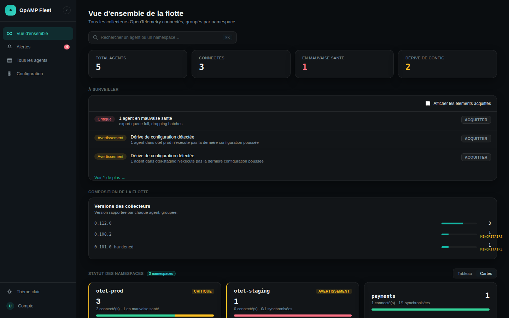
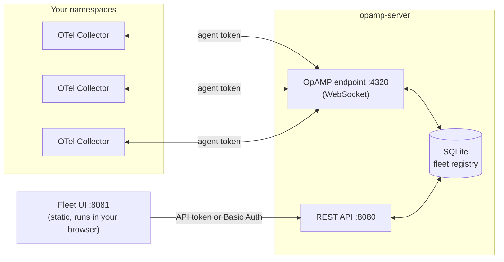

# 🛰️ OpAMP Fleet Server

[](https://github.com/anasschbada/opamp-fleet-server/actions/workflows/ci.yml)
[](https://github.com/anasschbada/opamp-fleet-server/actions/workflows/helm-release.yml)

An [OpAMP](https://github.com/open-telemetry/opamp-spec) server + web UI for
managing a fleet of **OpenTelemetry Collectors** — any distribution — from
one place: who's alive, what config is running where, and pushing a new
config on the fly.

Built to run on a Kubernetes cluster **with zero admin rights**: the server
never creates or needs a `ClusterRole`. Full details in
[`docs/RBAC.md`](docs/RBAC.md).


<sub>Example data, not a real deployment.</sub>

## ✨ What you get

- 🔭 **One registry for the whole fleet** — every collector self-reports
  its identity, health, and effective config over OpAMP; the server never
  calls the Kubernetes API to figure out who exists.
- ⚡ **Push config live** — no `ConfigMap` edit, no pod restart. A push
  goes back down the same OpAMP WebSocket the agent is already connected on.
- 🔐 **Two auth boundaries, on purpose** — a collector's token can never be
  used to call the REST API. See [why](#-authentication) below.
- 🖥️ **A real UI**, not a dashboard afterthought — namespace health, alerts
  derived from live agent state, a command palette (⌘K), light/dark theme.
- 📦 **Ships as raw manifests or a Helm chart** — pick whichever fits your
  GitOps setup; both are equivalent.
- 🕵️ **No RBAC, no telemetry, no phone-home** — see
  [`docs/RBAC.md`](docs/RBAC.md) and [`docs/SECURITY.md`](docs/SECURITY.md).

## 🧭 How it fits together



1. **Each collector self-describes** to the server over OpAMP (identity,
   health, effective config) — never a Kubernetes API call.
2. **The server keeps a registry in SQLite**: agents, their last known
   config, and config-push history.
3. **The REST API** reads that registry and lets you push a new config to
   an agent; the push travels back over the same OpAMP WebSocket.
4. **Two separate credentials** guard the two channels — see below.
5. **Metrics scraping is optional**: if a collector exposes its own
   Prometheus self-telemetry port, the server scrapes *only* the already-
   authenticated IP of that exact collector (no arbitrary address — an
   anti-SSRF guardrail, not a feature toggle you can point elsewhere).

## 🔐 Authentication

### Two token pools, never one

Collectors (OpAMP channel) and the UI/operators (REST API) use **two
separate token pools** (`AGENT_AUTH_TOKENS_FILE` / `API_AUTH_TOKENS_FILE`).
The server **refuses to start** if both env vars point at the same file.

Why it matters: a collector only ever needs to hold an OpAMP connection. If
it also held a valid API token, one compromised collector pod could push a
malicious config to *every other agent in the fleet* through the REST API.
Splitting the pools confines the blast radius of a single compromised pod
to "this collector has a rogue OpAMP session," never "the whole fleet is
pilotable."

### Optional: HTTP Basic Auth as a second login method

The REST API/UI can *additionally* accept a single HTTP Basic Auth
username/password (`BASIC_AUTH_USERNAME_FILE` / `BASIC_AUTH_PASSWORD_FILE`)
— off by default, and never a replacement for the API token pool. Useful
if you'd rather hand operators a memorable login than a bearer token.
Enable it with `auth.basicAuth.enabled=true` in the Helm chart, or the two
env vars directly (see `internal/config.Config`'s field comment).

Every failed attempt against either credential is throttled per source IP
(10 failures/minute → 429) and logged — see `internal/ratelimit`.

## 🚀 Local development

```bash
# Server -- two SEPARATE token files (see "Authentication" above)
export AGENT_AUTH_TOKENS_FILE=/tmp/agent-tokens.txt
export API_AUTH_TOKENS_FILE=/tmp/api-tokens.txt
echo "dev-agent-token" > /tmp/agent-tokens.txt
echo "dev-api-token" > /tmp/api-tokens.txt
export DATA_DIR=/tmp/opamp-dev
mkdir -p $DATA_DIR
go run ./cmd/opamp-server

# UI (separate terminal)
cd ui
npm install
npm run dev
```

Open the UI at the URL `npm run dev` prints, and log in with `dev-api-token`.

## ☸️ Kubernetes deployment

### Option A: Helm (generates your tokens for you)

```bash
helm install my-fleet ./deploy/helm/opamp-fleet-server \
  --namespace opamp-system --create-namespace \
  --set server.image.repository=YOUR_REGISTRY/opamp-fleet-server \
  --set ui.image.repository=YOUR_REGISTRY/opamp-fleet-ui
```

No token files to prepare first: leave `auth.agentTokens`/`auth.apiTokens`
at their defaults and the chart **generates a random token for each pool**,
prints how to retrieve it in the post-install notes, and keeps it **stable
across `helm upgrade`** (never silently rotated — see
`templates/secret-agent-tokens.yaml`). Bring your own tokens/Secrets, turn
on the optional Basic Auth login, or attach an `extraManifests` entry (e.g.
an Ingress) — see [`deploy/helm/opamp-fleet-server/README.md`](deploy/helm/opamp-fleet-server/README.md)
for all of it. The chart is also published as a GitHub Release, see
[CI/CD](#-cicd) below.

### Option B: raw manifests

```bash
kubectl apply -f deploy/k8s/platform/01-serviceaccount.yaml
kubectl apply -f deploy/k8s/platform/02-pvc.yaml
kubectl apply -f deploy/k8s/platform/03-configmap.yaml
# Generate real tokens before applying -- see the comment in each file:
kubectl apply -f deploy/k8s/platform/04-secret-agent-tokens.example.yaml
kubectl apply -f deploy/k8s/platform/05-secret-api-tokens.example.yaml
kubectl apply -f deploy/k8s/platform/07-deployment.yaml
kubectl apply -f deploy/k8s/platform/08-service.yaml
kubectl apply -f deploy/k8s/platform/09-networkpolicy.yaml

# The UI (never skip this)
kubectl apply -f deploy/k8s/platform/10-ui-serviceaccount.yaml
kubectl apply -f deploy/k8s/platform/11-ui-deployment.yaml
kubectl apply -f deploy/k8s/platform/12-ui-service.yaml
kubectl apply -f deploy/k8s/platform/13-ui-networkpolicy.yaml
# Optional: 14-secret-basicauth.example.yaml, see its own comment
```

(`00-namespace.yaml` is optional — see its comment if you can't create
namespaces yourself.)

Then, for every application namespace whose collectors you want to manage,
adapt the manifests in `deploy/k8s/collector-examples/` (see its own
README) — use an **agent** token, never the API one.

### Networking: one Ingress, not two

The server (`:8080`) and the UI (`:8081`) are separate Services on
purpose (see [why both listen on different ports](#-how-it-fits-together)
above), but that doesn't mean you need two Ingress objects. The UI already
assumes **same-origin, path-based routing** by default (no `API_BASE_URL`
configured): route `/api/*` to the server Service and `/` to the UI
Service, both under **one** Ingress/IngressRoute on one host.

Splitting them across two hostnames instead works too, but then you must
also set `API_BASE_URL` (`ui.apiBaseUrl` in the Helm chart) **and** add
CORS support server-side — this server ships with **no CORS headers by
design** (see `TestAPI_NoCORSHeadersByDefault`), so a cross-origin split
needs a code change first.

## 📁 Project layout

```
.
├── cmd/
│   ├── opamp-server/       main server (OpAMP + REST API)
│   └── fleet-ui-server/    tiny static file server for the UI
├── internal/
│   ├── opampserver/        OpAMP protocol: handshake, config push, in-memory registry
│   ├── api/                REST API consumed by the UI (routes, DTOs, middleware)
│   ├── auth/                agent/API token + optional Basic Auth verification
│   ├── ratelimit/          per-IP throttling for failed auth attempts
│   ├── store/               persistence (SQLite and in-memory, same interface)
│   ├── metrics/             optional self-telemetry scraping
│   └── config/               server config from environment variables
├── ui/                      React + TypeScript UI (Vite)
├── deploy/
│   ├── k8s/                raw Kubernetes manifests (no Helm)
│   └── helm/                equivalent Helm chart
├── docs/                    RBAC, security, production-readiness notes
├── Dockerfile                server image (opamp-server)
├── ui/Dockerfile             UI image (fleet-ui-server)
└── .github/workflows/        CI: build/test/scan, Docker images, Helm chart
```

<details>
<summary>Directory-by-directory notes</summary>

- **`cmd/opamp-server`** — entry point: starts the OpAMP channel (agents)
  and the REST API (UI), opens the SQLite store.
- **`cmd/fleet-ui-server`** — serves `ui/`'s static build in pure Go (no
  nginx), to keep the same dependency/CVE profile as the main server.
- **`internal/opampserver`** — server-side OpAMP protocol implementation:
  handshake, health, effective config, remote config push, stale-agent
  sweeping (`sweeper.go`).
- **`internal/api`** — REST routes the UI uses (agent list, component
  catalog, config push) and their middleware (auth, logging).
- **`internal/auth`** — parses/validates the two token files and the
  optional Basic Auth credential.
- **`internal/ratelimit`** — per-IP rate limiter on failed auth attempts
  (10/minute, 429 beyond that).
- **`internal/store`** — fleet registry storage interface, two
  implementations (SQLite for prod, in-memory for tests).
- **`internal/metrics`** — parses/scrapes optional Prometheus
  self-telemetry exposed by collectors.
- **`internal/config`** — reads server configuration from environment
  variables.
- **`ui/`** — React + TypeScript UI (Vite), talks to the REST API above,
  no mocked data.
- **`deploy/k8s`** — manifests ready for `kubectl apply`, no Helm/Kustomize.
- **`deploy/helm/opamp-fleet-server`** — Helm chart equivalent to the raw
  manifests (see its own README for values).
- **`docs/RBAC.md`** — why no `ClusterRole` is ever needed.
- **`docs/SECURITY.md`** — security scan results (gosec, gitleaks, npm
  audit, manual pentest).
- **`docs/PRODUCTION_READINESS.md`** — an honest take on what's ready for
  production and what isn't yet.
- **`.github/workflows/`** — see [CI/CD](#-cicd) below.

</details>

## 📋 Requirements

- **Go 1.25+** and **Node.js 22+** to build locally.
- **Docker** to build images (see `Dockerfile` and `ui/Dockerfile`). In an
  airgapped cluster, mirror the base images into your internal registry
  first — see the comment at the top of each Dockerfile.
- **A Kubernetes cluster** where you can create standard namespaced
  resources (Deployment, Service, ConfigMap, Secret, PVC, NetworkPolicy) —
  **no cluster-admin required**.
- **A StorageClass** for the SQLite registry's PVC (2Gi by default, see
  `deploy/k8s/platform/02-pvc.yaml`).
- No SSO/OIDC is built in — see [Authentication](#-authentication) above.

## 🔁 CI/CD

Two workflows in `.github/workflows/`:

- **`ci.yml`** — on every push/PR: build/vet/test/gosec/govulncheck (Go),
  build/typecheck/audit (UI), build both Docker images + Trivy scan,
  validate manifests/chart with kubeconform and `helm lint`. On a `v*` tag,
  also publishes both images to **GHCR**
  (`ghcr.io/<owner>/opamp-fleet-server` and `opamp-fleet-ui`) and to
  **Docker Hub** (`anasschb/images:opamp-fleet-server-<tag>` and
  `opamp-fleet-ui-<tag>`, plus a `-latest` tag). Needs the repo secrets
  `DOCKERHUB_USERNAME` and `DOCKERHUB_TOKEN` (a Docker Hub
  [access token](https://hub.docker.com/settings/security), not your
  password).
- **`helm-release.yml`** — on every push to `main` touching
  `deploy/helm/**`: packages the chart and publishes a **GitHub Release**
  with the `.tgz` (tag `opamp-fleet-server-<Chart.yaml version>`), and
  maintains a Helm index (`index.yaml`) on the `gh-pages` branch. To ship a
  new chart version: bump `version:` in
  `deploy/helm/opamp-fleet-server/Chart.yaml` and push to `main`.
- Dependabot keeps Go, npm, GitHub Actions, and Docker base image
  dependencies current.

To publish a new image version: tag and push (`git tag vX.Y.Z && git push
origin vX.Y.Z`).

## ✅ Tests / checks performed

- `go build ./...`, `go vet ./...`, `gofmt -l .` — clean.
- `go test ./... -race -cover` — full suite passes (auth incl. Basic Auth,
  rate limiting, config validation, storage, metrics parsing, OpAMP logic).
- `gosec ./...` — 0 findings. `gitleaks` over the full history — no
  secrets found. `npm audit` (UI) — 0 vulnerabilities.
- Manual pentest (path traversal, SQL injection, CRLF injection,
  oversized bodies, malformed YAML, CORS, rate limiting) — no issues found
  beyond one minor bug already fixed. See `docs/SECURITY.md`.
- `helm lint` + `helm template` + `kubeconform` on the chart and raw
  manifests — all valid, including the new auto-generated-secret,
  Basic Auth, and `extraManifests` paths.
- `npm run build` + `tsc -b` for the UI — clean; the full login/navigation
  flow (token login, Basic Auth login, namespace drill-down, command
  palette, alerts) verified against a running dev server.

See [`docs/PRODUCTION_READINESS.md`](docs/PRODUCTION_READINESS.md) for an
honest take on what's still missing before a high-stakes production
rollout (high availability, SSO, automated end-to-end integration tests).

## 🎨 Simplifications vs. the original design prototype

The UI reimplements all views and the config-push flow, but simplifies two
things from the original visual prototype: no CodeMirror/Monaco-style YAML
editor (a plain `<textarea>` is functional enough), and the pipeline
builder doesn't yet offer per-component inline YAML editing or custom
component entries. Config-generation logic (union of components per
signal) and the component catalog are generic — any OTel Collector
distribution, not hardcoded to one vendor.
